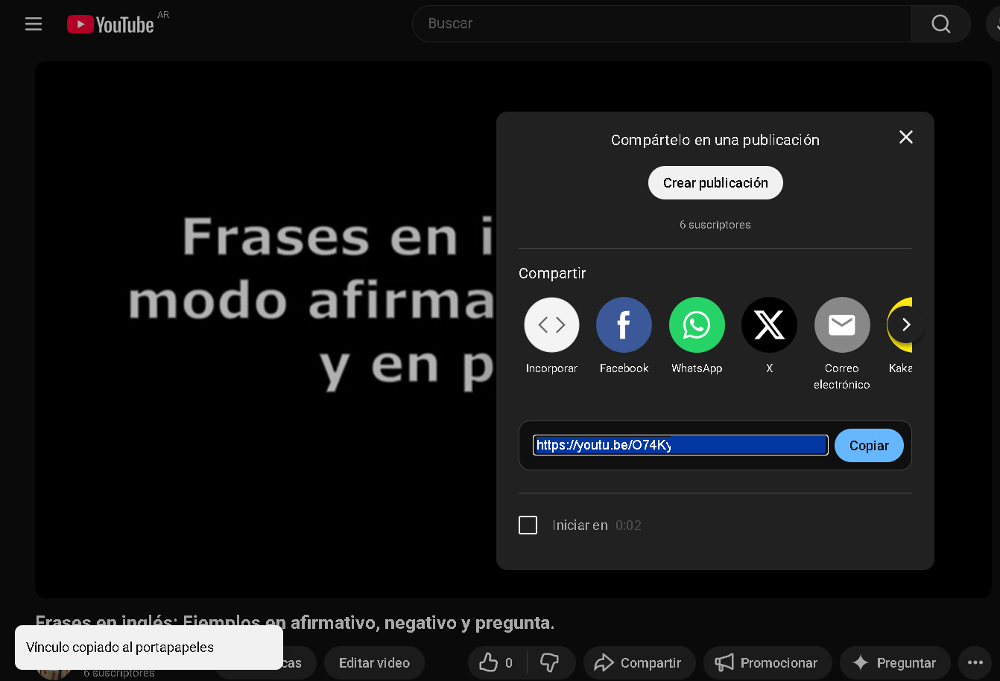
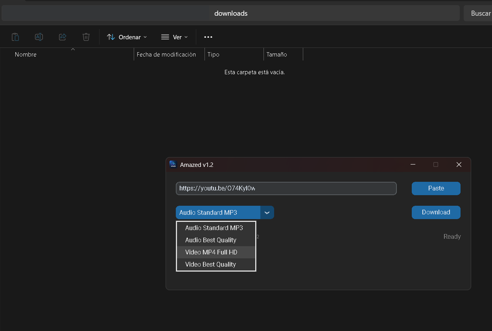
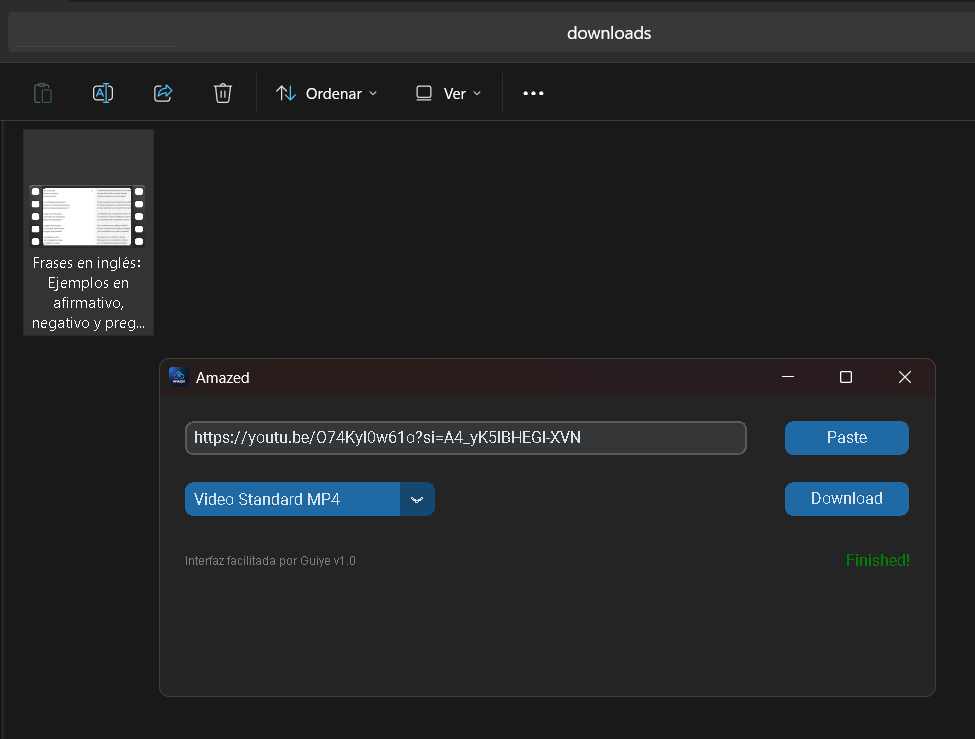

# Amazed v1.2 - Portable Media Downloader
### Desarrollado por Guillermo Yacob | Developed by Guillermo Yacob

Amazed is a high-performance, standalone, and portable desktop application built with **Python**. It simplifies media downloading and conversion with a focus on speed and user experience.

*Amazed es una aplicación de escritorio portátil de alto rendimiento construida con **Python**. Simplifica la descarga y conversión de medios con un enfoque en la velocidad y la experiencia del usuario.*

---

## 📸 Workflow & Screenshots / Flujo de Trabajo

| 1. Copy URL | 2. Paste & Configure | 3. Success & Output |
| :---: | :---: | :---: |
|  |  |  |
| *Copy your YouTube link* | *Paste, select format & download* | *Ready! Saved in /downloads* |
| *Copia tu link de YouTube* | *Pega, elige calidad y descarga* | *¡Listo! Guardado en /downloads* |

---

## 🚀 Key Technical Features / Características Técnicas

- **Multithreading Architecture**: Implements `threading` to handle background downloads, keeping the GUI fully responsive.
- **Subprocess Integration**: Orchestrates external C++ binaries (`yt-dlp`, `FFmpeg`, `ffprobe`) for robust processing.
- **Dynamic Dependency Validation**: Real-time checking of required binaries upon startup.
- **Advanced Path Management**: `sys.frozen` logic for true portability without installation.

## 🛠 Built With / Construido Con

* [CustomTkinter](https://github.com/TomSchimansky/CustomTkinter) - Modern UI.
* [yt-dlp](https://github.com/yt-dlp/yt-dlp) - Download engine.
* [FFmpeg](https://ffmpeg.org/) - Media framework.
* [Pyperclip](https://github.com/asweigart/pyperclip) - Clipboard management.

---

## 📦 Installation / Instalación

### English
1. Download the latest version from the [**Releases**](https://github.com/guillermoyacob/amazed/releases) section.
2. Ensure `yt-dlp.exe`, `ffmpeg.exe`, and `ffprobe.exe` are in the same directory as `Amazed.exe`.
3. Launch `Amazed.exe` and start downloading!

### Español
1. Descarga la última versión desde la sección de [**Releases (Lanzamientos)**](https://github.com/guillermoyacob/amazed/releases).
2. Asegúrate de que los archivos `yt-dlp.exe`, `ffmpeg.exe`, `ffprobe.exe` estén en el mismo directorio que `Amazed.exe`.
3. ¡Ejecuta `Amazed.exe` y comienza a descargar!

---

## ⚖️ Credits & Disclaimers / Créditos y Avisos Legales

**Developed by Guillermo Yacob.**

This application acts as a graphical interface (GUI) and is not affiliated, associated, authorized, endorsed by, or in any way officially connected with the developers of the third-party tools used. All product names, logos, and brands are property of their respective owners.

*Esta aplicación ha sido **desarrollada por Guillermo Yacob**. Funciona como una interfaz gráfica (GUI) y no tiene relación, afiliación o respaldo oficial con los desarrolladores de las herramientas de terceros utilizadas. Todos los nombres de productos, logotipos y marcas son propiedad de sus respectivos dueños.*

### 📜 Licenses / Licencias

* **Code**: Licensed under [MIT License](LICENSE).
* **Logo & Branding**: All rights reserved. The "Amazed" name and logo are proprietary and may not be used without explicit permission.
* **Third-party**:
    * **yt-dlp**: Licensed under [The Unlicense](https://unlicense.org/). 
    * **FFmpeg & ffprobe**: Licensed under [LGPL v2.1](https://www.gnu.org/licenses/old-licenses/lgpl-2.1.html).

---
* **Código**: Bajo la [Licencia MIT](LICENSE).
* **Logo y Marca**: Todos los derechos reservados. El nombre "Amazed" y su logotipo son propiedad del autor y no pueden ser utilizados sin permiso explícito.
* **Terceros**:
    * **yt-dlp**: Bajo [The Unlicense](https://unlicense.org/).
    * **FFmpeg & ffprobe**: Bajo [LGPL v2.1](https://www.gnu.org/licenses/old-licenses/lgpl-2.1.html).

---
Desarrollado con 💙 por [Guillermo Yacob](https://github.com/guillermoyacob) - 2026
